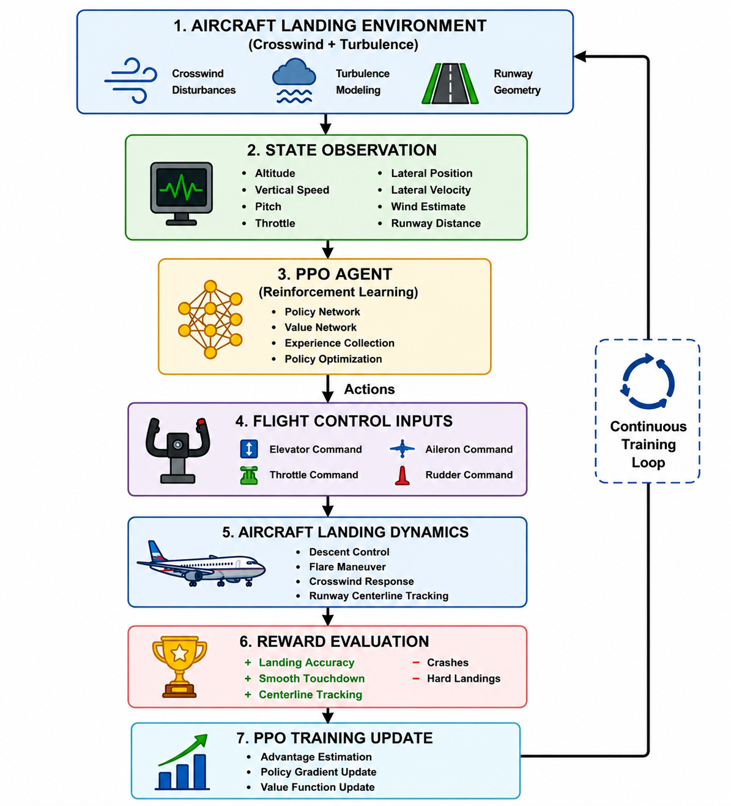
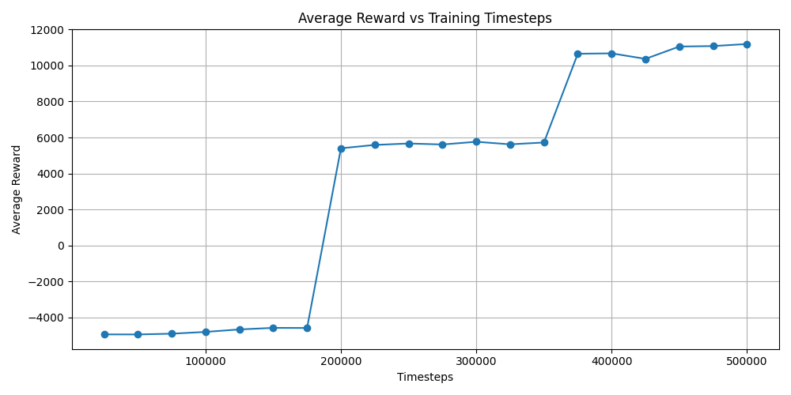
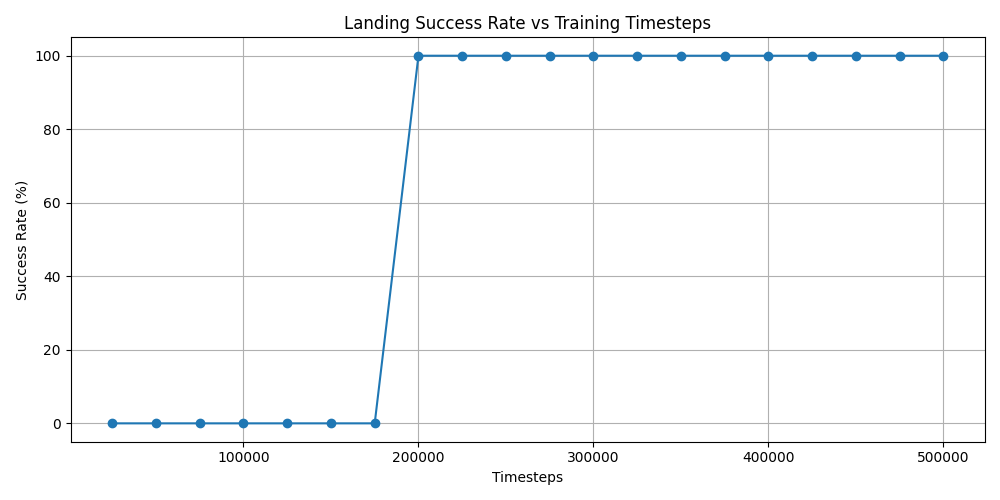
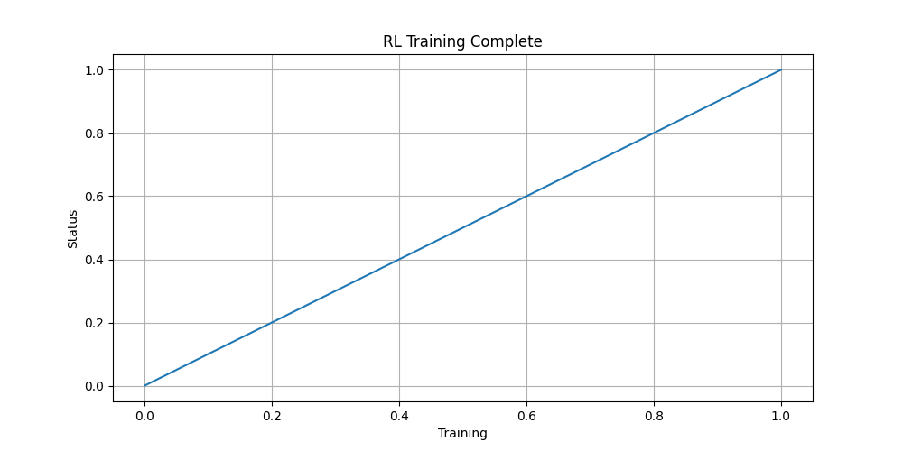
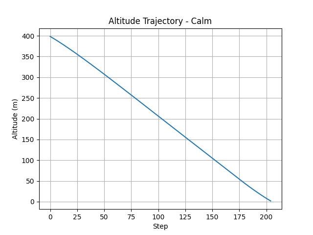
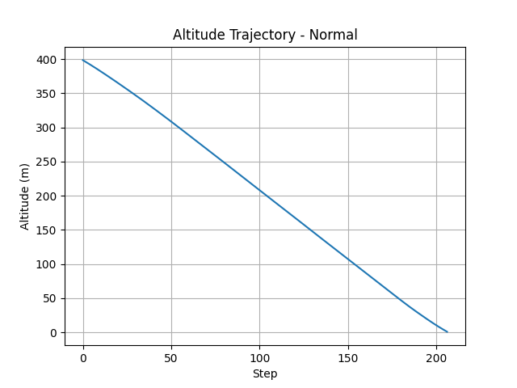
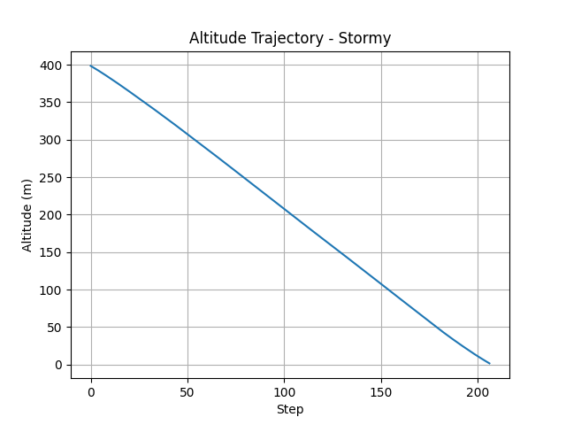

# Reinforcement Learning for Autonomous Aircraft Landing in Crosswinds


---

## Overview

This project develops an autonomous aircraft landing system using Reinforcement Learning (RL) to perform safe landings under varying crosswind and turbulence conditions.

The objective is to train an intelligent agent capable of learning optimal landing strategies that outperform traditional heuristic controllers while maintaining touchdown accuracy, stability, and safety.

The project was implemented in Python using Gymnasium and Stable-Baselines3 with the Proximal Policy Optimization (PPO) algorithm.

---

## Key Contributions

- Developed a custom Gymnasium-based aircraft landing environment.

- Designed a crosswind and turbulence disturbance model.

- Implemented PPO-based autonomous landing control.

- Achieved 100% landing success under training conditions.

- Demonstrated 90% success under previously unseen wind conditions.

- Outperformed a conventional heuristic controller in touchdown quality.

- Evaluated policy robustness using Monte Carlo simulations.

- Demonstrated autonomous adaptation to varying environmental disturbances.

---

## Project Scope

This project investigates the application of Reinforcement Learning to one of the most challenging phases of flight: aircraft landing under adverse environmental conditions.

The framework integrates custom flight simulation, disturbance modeling, autonomous decision-making, policy optimization, baseline controller comparison, and robustness evaluation within a unified autonomous flight control environment.

---

## System Architecture



---

## Problem Statement

Crosswind landings are among the most challenging phases of flight.

Strong crosswinds and turbulence can result in:

- Runway centerline deviations

- Hard landings

- Loss of control during flare

- Increased pilot workload

Traditional controllers rely on predefined rules and often struggle under highly variable environmental conditions.

This project investigates whether Reinforcement Learning can learn adaptive landing strategies that maintain safety and touchdown quality under changing wind conditions.

---

## Environment Design

### State Space

The RL agent observes:

1. Altitude

2. Vertical Speed

3. Pitch Angle

4. Throttle Position

5. Lateral Position

6. Lateral Velocity

7. Wind Estimate

8. Runway Distance

### Action Space

Continuous control inputs:

1. Elevator / Pitch Command

2. Throttle Command

3. Roll Command

4. Rudder Command

---

## Disturbance Modeling

The environment introduces:

- Random Crosswinds

- Random Turbulence

- Lateral Drift Effects

Wind conditions are randomized every episode to improve policy robustness and generalization.

---

## Reward Function

The reward structure encourages:

- Accurate runway centerline tracking

- Stable descent profiles

- Smooth flare execution

- Low touchdown sink rate

- Minimal control effort

Penalties are applied for:

- Large lateral deviations

- Unsafe descent rates

- Runway excursions

- Crashes

---

## Reinforcement Learning Framework

### Algorithm

**Proximal Policy Optimization (PPO)**

### Training Library

**Stable-Baselines3**

### Training Parameters

| Parameter | Value |
|------------|---------|
| Learning Rate | 1e-4 |
| Batch Size | 256 |
| n_steps | 4096 |
| Gamma | 0.995 |
| GAE Lambda | 0.98 |
| Clip Range | 0.15 |
| Entropy Coefficient | 0.005 |
| Total Timesteps | 500,000 |

---

## Baseline Controller

A conventional heuristic autopilot controller was implemented as a benchmark.

The controller performs:

- Descent Profile Tracking

- Flare Scheduling

- Lateral Centerline Correction

- Rudder-Based Drift Compensation

The baseline controller serves as a reference for evaluating RL performance improvements.

---

## Evaluation Methodology

Performance was assessed using Monte Carlo simulations over 100 randomized landing scenarios.

Wind intensity and turbulence conditions were randomized for every episode to evaluate robustness and generalization.

The trained policy was evaluated under both training and previously unseen wind conditions to assess out-of-distribution performance.

---

# Results

## PPO Evaluation (Training Wind Conditions)

The PPO agent was evaluated under wind conditions encountered during training (0.5–3.0 wind intensity range).

| Metric | Result |
|----------|----------|
| Success Rate | 100% |
| Smooth Landings | 99 |
| Hard Landings | 1 |
| Crashes | 0 |
| Mean Lateral Error | 0.868 m |
| Maximum Lateral Error | 6.206 m |
| Mean Touchdown Vertical Speed | 1.055 m/s |
| Maximum Touchdown Vertical Speed | 1.270 m/s |

---

## PPO Evaluation (Unseen Wind Conditions)

The trained policy was evaluated under previously unseen wind conditions (4.0–6.0 wind intensity range).

| Metric | Result |
|----------|----------|
| Success Rate | 90% |
| Smooth Landings | 69 |
| Hard Landings | 21 |
| Crashes | 10 |
| Mean Lateral Error | 4.402 m |
| Mean Touchdown Vertical Speed | 1.090 m/s |

The policy maintained a 90% landing success rate under wind conditions not encountered during training, demonstrating strong generalization capability.

---

## Heuristic Controller Performance

| Metric | Result |
|----------|----------|
| Success Rate | 100% |
| Smooth Landings | 0 |
| Hard Landings | 100 |
| Crashes | 0 |

---

## Controller Performance Comparison

The comparative study evaluates landing quality achieved by traditional heuristic control and reinforcement learning-based control strategies under identical operating conditions.

| Metric | Heuristic Controller | PPO Agent |
|----------|----------|----------|
| Success Rate | 100% | 100% |
| Smooth Landing Rate | 0% | 99% |
| Hard Landing Rate | 100% | 1% |
| Mean Lateral Error | 5–8 m | 0.868 m |
| Mean Touchdown Vertical Speed | \~1.8 m/s | 1.055 m/s |
| Landing Quality | Moderate | Excellent |

---

## Training Performance

### Reward Curve



### Success Rate Curve



### Training Progress



---

## Landing Trajectory Analysis

### Calm Weather Landing



### Moderate Crosswind Landing



### Severe Crosswind Landing



---

## Discussion

The PPO-based Reinforcement Learning agent successfully learned autonomous landing strategies capable of maintaining runway alignment, controlling touchdown sink rate, and adapting to varying crosswind conditions.

Compared to the heuristic controller, the RL agent achieved substantially smoother landings while maintaining a perfect success rate under nominal operating conditions.

The results demonstrate the potential of Reinforcement Learning for future autonomous flight control and intelligent landing assistance systems.

---

## Project Outcome

The trained PPO agent successfully learned autonomous landing behavior under varying crosswind conditions.

Key achievements include:

- 100% landing success under training wind conditions.

- 99% smooth landing rate.

- Mean lateral touchdown error below 1 meter.

- Mean touchdown sink rate of 1.055 m/s.

- 90% success rate under previously unseen wind disturbances.

These results demonstrate the potential of Reinforcement Learning for autonomous flight control and landing assistance systems.

---

## Repository Structure

```text
RL_Aircraft_Project/
│
├── aircraft_env.py
├── train_ppo.py
├── evaluate_model.py
├── heuristic_autopilot.py
├── test_trained_model.py
│
├── aircraft_landing_ppo.zip
│
├── reward_curve.png
├── success_rate_curve.png
├── training_progress.png
│
├── landing_trajectory_Calm.png
├── landing_trajectory_Normal.png
├── landing_trajectory_Stormy.png
│
├── docs/
│   └── images/
│       └── architecture_diagram.png
│
├── report/
│   └── RL_Autonomous_Landing_Report.pdf
│
└── README.md
```
---

## Installation

```bash
pip install gymnasium
pip install stable-baselines3
pip install numpy
pip install matplotlib
```
---

## Training

```bash
python train_ppo.py
```
---

## Evaluate Trained Model

```bash
python evaluate_model.py
```
---

## Run Baseline Controller

```bash
python heuristic_autopilot.py
```
---

## Technologies Used

- Python

- Gymnasium

- Stable-Baselines3

- PPO (Proximal Policy Optimization)

- NumPy

- Matplotlib

- Reinforcement Learning

- Autonomous Flight Control

---

## Research Relevance

This project lies at the intersection of:

- Flight Dynamics

- Guidance, Navigation and Control (GNC)

- Autonomous Systems

- Reinforcement Learning

- Aerospace Artificial Intelligence

The methodology can be extended to:

- UAV Autonomy

- Autonomous Taxiing

- Intelligent Flight Management Systems

- Adaptive Flight Control

- Spacecraft Guidance and Control

- Autonomous Aerospace Systems

---

## Future Improvements

- JSBSim 6-DOF Aircraft Dynamics Integration

- FlightGear Visualization Interface

- SAC and TD3 Controller Comparison

- LSTM-PPO Architectures

- Dryden Turbulence Modeling

- Domain Randomization

- Sim-to-Sim Transfer Learning

- Hardware-in-the-Loop Validation

---

## Full Technical Report

A detailed project report including:

- Aircraft Landing Environment Design

- Reinforcement Learning Framework

- PPO Training Methodology

- Disturbance Modeling

- Baseline Controller Development

- Performance Evaluation

- Generalization Analysis

- Landing Trajectory Assessment

- Results and Discussion

is available in:

📄 `report/RL_Autonomous_Landing_Report.pdf`

---

## Author

**Amaraneni Vinitha**

B.Tech Aeronautical Engineering

Research Interests:

- Flight Control Systems

- Autonomous Aircraft

- Reinforcement Learning

- AI for Aerospace Applications

- Guidance, Navigation and Control (GNC)

